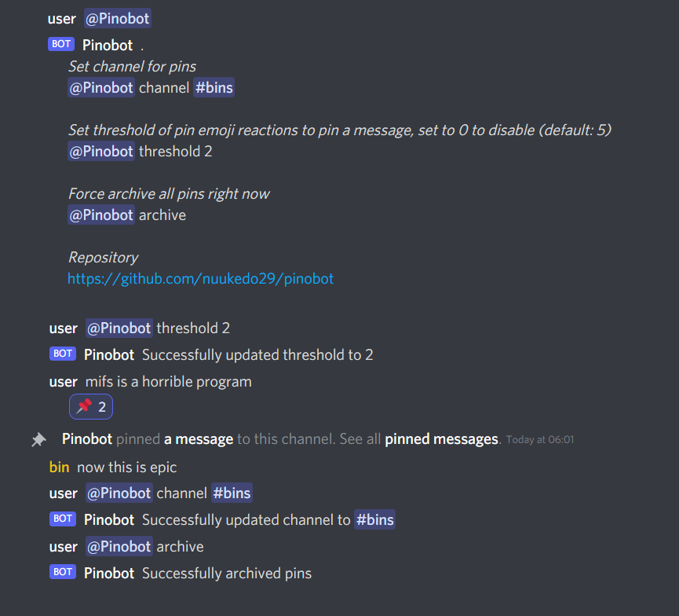

# Pinobot 

Pin archival bot for Discord




## Invite public bot
[https://discord.com/oauth2/authorize?client_id=873839734521229323&permissions=75776&scope=bot](https://discord.com/oauth2/authorize?client_id=873839734521229323&permissions=75776&scope=bot)

All changes made in the repository are automatically deployed in the public bot


## Self-host

docker-compose.yml

```yaml
version: "3"
services:

  pinobot:
    image: ghcr.io/nuukedo29/pinobot
    restart: unless-stopped
    environment:
      - DISCORD_TOKEN=<YOUR TOKEN HERE>
```

P.S. bin was never here